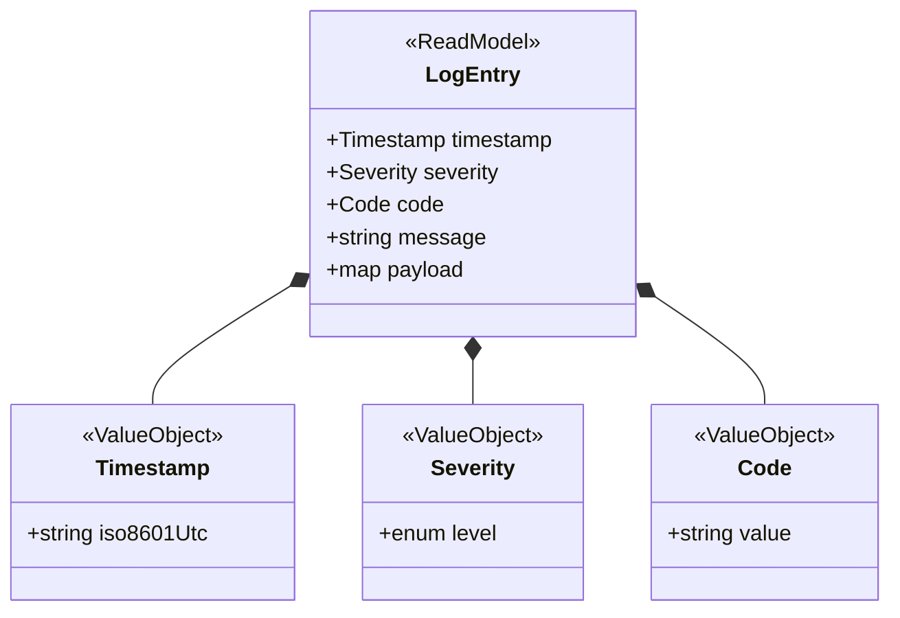
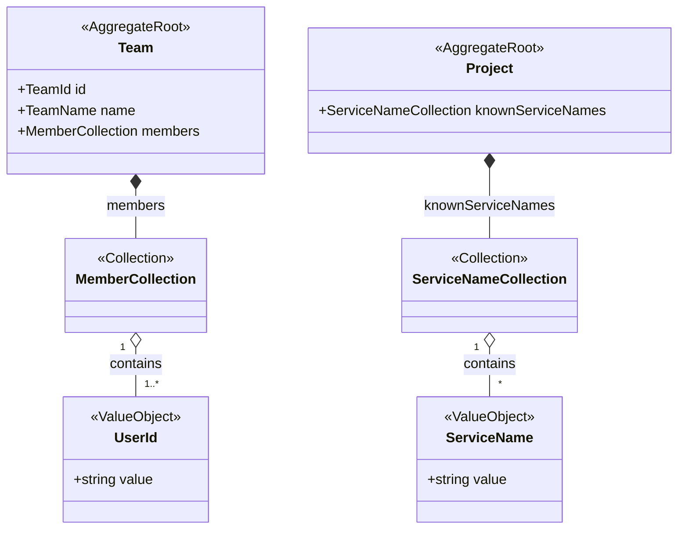

# Feedback — read-only bounded contexts, primitives as value objects, typed collections

**Date**: 2026-10-01
**Source session**: `/speckit.bc` + `/speckit.model` for the **Observability** bounded context in Podium (Hostium)
**Status**: Applied in 1.1.0 (prompts now live in `src/core/`; line references below point to the pre-1.1.0 `commands/` files)

---

## 1. Context

Podium is a deployment platform: a team pushes a public repo and gets a public URL, and everything in between (polling, build, deploy) runs inside the platform. The session modeled where a team reads what happened to its code:

- the **runtime logs** its deployed application writes;
- the **build and deploy records** that explain a failure before anything runs.

Before the session, those reads had been implemented inside the App Manager BC. The architect rejected that for two reasons:

- A log is a read entity that another piece produces (an OpenTelemetry node agent writes to Loki), so it does not belong to App Manager.
- The application service contained decisions: a ternary choosing between "last N lines" and "lines after a cursor", and an ownership check. Even a ternary is a branch and raises cyclomatic complexity.

The session produced a BC with:

- **no aggregate** — it is a read model over Loki; every line is read straight into an immutable DTO;
- **no domain events today** — "error observed" is deferred until Remediation is modeled;
- **two read models** — the standard log entry (timestamp, severity, code, message, payload), and the build/deploy record (the same fields plus the phase it was written in);
- **one read invariant** — a record only ever contains lines tagged with the requested project, and the requested application or attempt;
- **one shared kernel type**, `Criteria` (filters + order + limit), ported from `php-barcelona`. With it, "last N" and "after a cursor" are two different criteria, not a branch in the service.

Artifacts produced, in the Podium repo:

- `docs/podium-domain/observability/discovery.md`
- `docs/podium-domain/observability/model.md`
- `docs/podium-domain/observability/model.mermaid`
- `docs/podium-domain/shared-kernel/model.md`

The skill did not fit this BC in three places. They are described below with concrete prompt changes.

---

## 2. Before anything else: the installed copy was stale

Podium's installed skills (`.claude/skills/speckit-speckit-ddd-{bc,model}/SKILL.md`) are an older copy than `commands/` in this repo. They lack:

- **path resolution through `ddd-config.yml`.** The session had to write to `docs/podium-domain/` by hand, because the stale prompt hardcodes `docs/domain/`;
- **the *Primitive encapsulation rule*** (`speckit.bc.md`, §"Primitive encapsulation rule", line 141);
- **the *Domain Action Candidates* table and checklist item.**

Proposals:

- Each prompt states its version in a header line, e.g. `<!-- speckit-ddd 1.1.0 -->`, and the bootstrap tells the architect when it detects an older installed copy than the one it was generated from.
- `docs/usage.md` documents how to refresh an installed copy (`specify extension add speckit-ddd` again, or the update path Spec Kit supports).

---

## 3. Improvement 1 — read-only bounded contexts

### Problem

Both closure gates assume a write model:

- `speckit.bc.md` §"Proposing closure" (line 240) requires an aggregate root, a domain action and a domain event.
- `speckit.model.md` §"Bootstrap → Before proceeding, verify" (line 50) refuses to generate without them.

A BC whose job is to read data produced elsewhere can never pass either gate. In the session the gate had to be bypassed by hand, and the model needed an invented `<<ReadModel>>` stereotype.

The question order (`speckit.bc.md` §"Question discipline", line 101) also goes straight to "things that change together" (aggregates). It never asks whether the context changes anything at all. In this session that question was the one that unlocked the whole model.

### Proposed changes

**a) Ask it early.** Insert a question after question 1 in §"Question discipline":

```markdown
2. Does this context change state and protect its own rules, or does it only
   read data that another part of the system produces?
   (If it only reads, it is a read-only context: see "Read-only contexts" below.
   Skip the aggregate and domain action questions; ask the read-model ones.)
```

**b) A read-only section** in §"Discovery Rules", after §"Primitive encapsulation rule":

```markdown
### Read-only contexts

Some contexts never change state: they read data that infrastructure or another
context produces, and only shape and filter it (logs, metrics, search, reporting).
They have no aggregate and usually no domain events — that is a valid model,
not a gap. When the architect confirms a context is read-only:

- Record it in discovery.md as an explicit decision: `**Kind**: Read-only`.
- Ask, one at a time:
  1. Who produces this data, and where does it live?
  2. What does each read model contain? (fields, and which of them carry rules)
  3. What must a read never return? (read invariants — e.g. "only lines tagged
     with the requested project")
  4. Does the data carry its own identity (tags, labels), or must this context
     ask other contexts to know whom it belongs to?
  5. Who decides whether a caller may read it — this context, or the boundary
     (controller / BFF)?
  6. Is anything persisted here, or is it read on demand only?
- Read models are immutable DTOs. They are not aggregates and have no behaviour.
- Dynamic reads are expressed as a Criteria (filters + order + limit) given to
  a repository, never as branches in the application service.
```

**c) An alternative closure checklist** in §"Proposing closure":

```markdown
For a read-only context (`**Kind**: Read-only`), use this checklist instead:

✅ At least one read model confirmed, with its fields
✅ At least one read invariant confirmed (what a read must never return)
✅ The producer of the data recorded
✅ How reads are expressed (Criteria / repository) recorded
✅ "No aggregate" and, when it applies, "no domain events" recorded as decisions
✅ All ubiquitous language key terms confirmed
✅ No open ambiguities that affect the model
```

`speckit.model.md` §"Before proceeding, verify" (line 50) must accept either checklist, depending on `**Kind**`.

**d) Model template.** In `speckit.model.md` §"Formalization → model.md" (line 88), for a read-only context, replace §Aggregates with:

```markdown
## Aggregates

None — read-only context. {One sentence: who produces the data.}

## Read Models

| Name | Fields | Source | Read invariants |
|---|---|---|---|

## Queries

| Repository | Accepts | Returns |
|---|---|---|
| {Name} | SK::Criteria | {Read model} |
```

Keep §Domain Events, with a line for deferred events (`🕓 Deferred`), so a context that will emit later says so explicitly.

**e) Mermaid rules** (`speckit.model.md` §"model.mermaid", line 179). Add:

- `<<ReadModel>>` for immutable read DTOs, and `<<Repository>>` for the reader.
- `Repository ..> Criteria : searches by` and `Repository ..> ReadModel : returns`.
- A deferred event is drawn with a dashed arrow labelled `deferred`, never `emits`.

**f) Capture where each rule lives.** In this session the architect stated a constraint that applies to every context: the application service orchestrates only (load → call → persist → dispatch) and contains no branching, not even a ternary. The skill should keep a short `## Rule placement` list in discovery.md: for each confirmed rule, whether it lives in the domain, in a Criteria, at the boundary (request validation, authorization) or in infrastructure. `/speckit.plan` can then generate services with no decisions in them.

---

## 4. Improvement 2 — primitives are noted as value objects

### Problem

The rule already exists (`speckit.bc.md` §"Primitive encapsulation rule", line 141). It was not applied consistently while taking notes. Two values the architect described as plain primitives were first recorded as loose fields:

- the line timestamp: "ISO 8601, in UTC";
- the line code: "a code of any kind — HTTP status, exit code, application error code".

The read-only case also needs an explicit exception, which the current rule does not have.

### Proposed changes

**a) Make note-taking mechanical.** Append to §"Primitive encapsulation rule":

```markdown
Note-taking is mechanical, not a judgement call: the moment the architect
describes a value by its primitive shape ("an ISO 8601 date in UTC", "a code,
any kind", "a number between 1 and 1000"), add a row to Value Object Candidates
with `Kind: basic (wraps {primitive})` and the construction rule exactly as
stated. Then reference that VO by name wherever the value appears. Never write
the primitive into an aggregate, entity or composite VO row.
```

**b) The read-model exception.**

```markdown
Exception — read models: fields of an immutable read DTO may be primitives at
the boundary when they carry no rule (a free-text message, an opaque payload).
A field that does carry a rule (a closed set, a format, a range) is still a VO,
even inside a read model.
```

### Before / after, from the session

Before — how the values were first noted in `discovery.md`, as prose inside a ubiquitous-language term, with no Value Object row:

```markdown
| Log estándar (standard log) | The common shape every line is transformed to:
  timestamp (ISO 8601, UTC), severity, code, message and payload | ✅ Confirmed |
```

The format of the timestamp and the "any kind of code" rule existed only in that sentence. The `Timestamp` and `Code` rows in Value Object Candidates were added two exchanges later, when they should have been added the moment the architect said "ISO 8601 in UTC".

After — as it ended up in the model (`observability/model.mermaid`):



`message` and `payload` stay primitive: they carry no rule, so the read-model exception applies. `Timestamp` (a format), `Severity` (a closed set) and `Code` (an opaque value, which may be absent) are VOs.

---

## 5. Improvement 3 — lists are typed collections

### Problem

The skill lets a list of domain things be written as a generic list. Two existing Podium models do exactly that:

| File | Line | As written |
|---|---|---|
| `docs/podium-domain/team/model.md` | 17 | `+members: List~UserId~` |
| `docs/podium-domain/project/model.md` | 18 | `+knownServiceNames: List~string~` — a primitive inside a list |

In a language without typed collections (PHP), that becomes a raw `array`. The element type, and any rule on the list (not empty, no duplicates, at least one member), is lost: exactly the primitive obsession the extension exists to prevent.

### Reference implementation

`php-barcelona/src/Shared/Domain/Collection.php` is an abstract typed collection:

- `type()` declares the element type, and the constructor asserts every item against it (`Assert::arrayOf`);
- it implements `Countable` and `IteratorAggregate`;
- `toArrayPrimitive()` gives the boundary representation.

A concrete collection is one small class, e.g. `src/Contexts/Blog/Post/Domain/PostCollection.php`.

### Proposed changes

**a) A collection rule** in `speckit.bc.md` §"Discovery Rules", next to the primitive rule:

```markdown
### Collection rule

When a concept is "a list of" something in the domain (members, known service
names, order lines), note it as a named collection, never as a generic list:

- Name it after what it holds: `MemberCollection`, `ServiceNameCollection`.
- Record its element type (a VO or entity, never a raw primitive) and the rules
  the list itself enforces (not empty, no duplicates, max size, ordering).
- Add it to Value Object Candidates with `Kind: collection (of {Type})`.

Whether it becomes a typed class or a native typed list is a language concern:
read `collections` from ddd-config.yml (`typed-class` | `native`). With
`typed-class`, the model names the collection type everywhere. With `native`,
the model may write `List<{Type}>`, but the element type must still be a named
type, never a primitive.
```

**b) Config.** Add to `ddd-config.template.yml`:

```yaml
# How "a list of X" is represented in the model.
# typed-class: a named collection type per list (e.g. PHP, where arrays are untyped)
# native:      the language's own typed list (List<X>), element type still a VO
collections: typed-class
```

**c) Value Objects table** (`speckit.model.md` §"Value Objects", line 130): add `collection` as a third `Kind`, alongside `basic` and `composite`. The `Base / Components` column holds the element type, and §Detail lists the list-level rules.

**d) Mermaid rules.** A collection is drawn as its own class with `<<Collection>>`. The owner references it by name, and a `contains` relation points to the element type.

### Before / after, from the existing models



`Team`'s invariant, "at least one member, always", now has an obvious home: `MemberCollection` refuses to be empty.

---

## 6. Minor observations

- **No shared kernel file yet.** The session confirmed the first shared kernel type (`Criteria`) in a project whose context map listed shared concepts in a table, but where `shared-kernel/model.md` did not exist. The model command created it, as its §"Shared Kernel update" says. It should also add the type to the project's context map when one exists, or say that it did not.
- **Offer Criteria.** Dynamic reads came up naturally and were solved with the Criteria pattern. When the architect describes "filter by X, sorted by Y, the last N", the skill could propose `SK::Criteria` (filters + order + limit) itself, instead of a dedicated value object per query shape.
- **No `.speckit.constitution`.** Podium has none: its conventions live in `CLAUDE.md` and `docs/podium-domain/context-map.md`. The bootstrap should fall back to an existing context map / architecture doc, and say which one it used, instead of silently skipping the constitution.

---

## 7. Proposed changes by file

| File | Change |
|---|---|
| `commands/speckit.bc.md` | New question 2 (read or write); §"Read-only contexts"; read-only closure checklist; mechanical note-taking and read-model exception in §"Primitive encapsulation rule"; §"Collection rule"; `## Rule placement` in the discovery template; `**Kind**` header in the discovery template; constitution fallback in the bootstrap |
| `commands/speckit.model.md` | Coverage check accepts the read-only checklist; §Read Models and §Queries in the template; `collection` VO kind; Mermaid stereotypes `<<ReadModel>>`, `<<Repository>>`, `<<Collection>>` and the `deferred` arrow; update the context map when adding a shared kernel type |
| `ddd-config.template.yml` | `collections: typed-class \| native` |
| All prompts | A version header; detect stale installed copies |
| `CHANGELOG.md` | `## [Unreleased]` — Added: read-only contexts, collection rule, `collections` config, prompt version header. Changed: primitive note-taking is mechanical, with a read-model exception |
